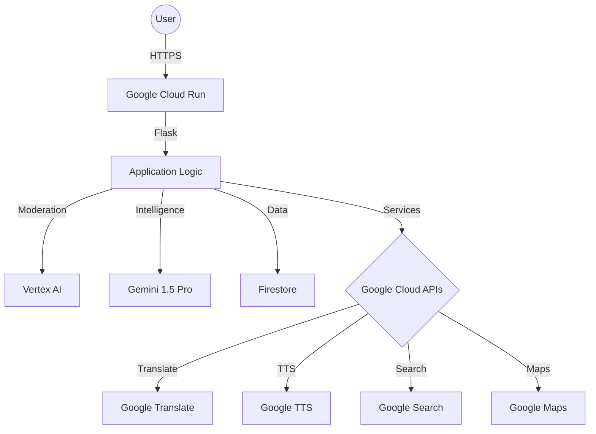

# 🏛️ Election Process Education Assistant

A production-grade, AI-powered platform designed to provide non-partisan, factual information about election processes, voter registration, and democratic participation. Built with Google Cloud and Gemini AI.

[](https://election-assistant-placeholder.a.run.app)
[](https://opensource.org/licenses/MIT)

## 🌟 Features

- **🤖 AI Chatbot**: Interactive guidance on election topics powered by Gemini 1.5 Pro.
- **🌐 Multilingual Support**: Real-time translation into 10+ languages using Google Translate API.
- **🔊 Text-to-Speech**: Listen to AI responses for enhanced accessibility.
- **📰 Live News**: Stay updated with election-related news via Google Custom Search.
- **📍 Polling Station Locator**: Find your nearest polling station with Google Maps integration.
- **🏆 Knowledge Quiz**: Test your civic knowledge with AI-generated quizzes.
- **⏳ Election Timelines**: Explore historical and upcoming election milestones globally.
- **♿ WCAG 2.1 AA Compliant**: High accessibility standards for inclusive use.
- **📱 Mobile Responsive**: Optimised experience across all devices.

## 🛠️ Tech Stack

- **Backend**: Python 3.11, Flask, Gunicorn
- **AI/ML**: Google Gemini 1.5 Pro, Vertex AI (Content Moderation)
- **Cloud Infrastructure**: Google Cloud Run, Cloud Build
- **APIs**:
  - Google Translate API
  - Google Text-to-Speech API
  - Google Custom Search API
  - Google Maps Embed API
- **Persistence**: Firebase Firestore
- **Analytics**: Google Analytics 4
- **Security**: Flask-Talisman, Flask-Limiter, bleach (Sanitisation)

## 🏗️ Architecture



## 🚀 Setup Instructions

### Prerequisites
- Python 3.11+
- Google Cloud Project with billing enabled
- Enabled APIs: Gemini, Vertex AI, Translate, TTS, Custom Search, Firestore

### Local Installation

1. **Clone the repository:**
   ```bash
   git clone https://github.com/your-repo/election-assistant.git
   cd election-assistant
   ```

2. **Create a virtual environment:**
   ```bash
   python -m venv .venv
   source .venv/bin/activate  # On Windows: .venv\Scripts\activate
   ```

3. **Install dependencies:**
   ```bash
   pip install -r requirements.txt
   ```

4. **Configure environment variables:**
   Create a `.env` file based on `.env.example`.

5. **Run the application:**
   ```bash
   python main.py
   ```
   The app will be available at `http://localhost:8080`.

## 🔑 Environment Variables

| Variable | Description |
|----------|-------------|
| `GOOGLE_API_KEY` | API Key for Gemini AI |
| `GOOGLE_CLOUD_PROJECT` | Your GCP Project ID |
| `GOOGLE_TRANSLATE_API_KEY` | API Key for Google Translate |
| `GOOGLE_TTS_API_KEY` | API Key for Google Text-to-Speech |
| `GOOGLE_SEARCH_API_KEY` | API Key for Custom Search |
| `GOOGLE_SEARCH_ENGINE_ID` | Search Engine ID (CX) |
| `GOOGLE_MAPS_API_KEY` | API Key for Google Maps Embed |
| `GA_MEASUREMENT_ID` | Google Analytics 4 ID |
| `FLASK_SECRET_KEY` | Secret key for Flask sessions |

## 📸 Screenshots

*(Add your screenshots here)*

---

Developed for **Election Process Education** with ❤️ and AI.
