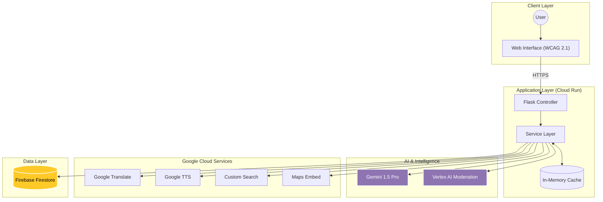

# 🏛️ Election Process Education Assistant

<div align="center">
  <p align="center">
    
    
    
    
    
  </p>

  **Empowering citizens with factual, accessible, and AI-driven election intelligence.**
</div>

---

## 🌟 Overview

The **Election Process Education Assistant** is a production-grade platform designed to bridge the information gap in democratic processes. By leveraging **Google Gemini 1.5 Pro** and **Google Cloud**, it provides non-partisan guidance, real-time news, and essential voter resources in a secure, multilingual environment.

> [!IMPORTANT]
> This platform is built for high-scale, production environments with a focus on **Security**, **Accessibility (WCAG 2.1 AA)**, and **Accuracy**.

---

## 🚀 Key Pillars

### 🧠 Intelligent Guidance
Powered by **Gemini 1.5 Pro**, the assistant provides deep insights into complex election topics, from voter registration requirements to historical context, ensuring factual correctness through grounding.

### 🌍 Universal Access
- **Multilingual Mastery**: Real-time support for 10+ languages via Google Translate API.
- **Inclusive Design**: WCAG 2.1 AA compliance and integrated **Text-to-Speech (TTS)** for users with visual impairments.

### 📡 Real-Time Verification
- **Live Intelligence**: Dynamic news fetching via Google Custom Search.
- **Geospatial Tools**: Integrated Polling Station locator using Google Maps Embed.
- **Gamified Learning**: AI-generated quizzes to test and improve civic knowledge.

### 🛡️ Enterprise Security
- **Content Moderation**: Automated safety checks via Vertex AI.
- **Robust Protection**: Built-in rate limiting, CSRF protection, and deep input sanitization.
- **Production Ready**: Structured JSON logging and high-performance caching.

---

## 🛠️ Tech Stack

| Component | Technology |
| :--- | :--- |
| **Backend** | Python 3.11, Flask, Gunicorn |
| **AI Engine** | Google Gemini 1.5 Pro, Vertex AI |
| **Data & Auth** | Firebase Firestore |
| **Cloud** | Google Cloud Run, Cloud Build, Cloud Logging |
| **Security** | Flask-Talisman, Flask-Limiter, Bleach |
| **Frontend** | Modern HTML5/CSS3 (Responsive), Jinja2 |

---

## 🏗️ System Architecture



---

## 📂 Project Structure

```text
election-assistant/
├── main.py              # Application entry point & controller
├── config.py            # Global configuration & security settings
├── models.py            # Typed data structures (Dataclasses)
├── services/            # Business logic (Service Layer)
│   ├── gemini_service.py    # AI Chat & Quiz generation
│   ├── vertex_service.py    # Content moderation & classification
│   ├── firebase_service.py  # Session & score persistence
│   └── ...                  # Translate, TTS, Search services
├── static/              # Frontend assets (CSS, JS, Images)
├── templates/           # Jinja2 HTML templates
├── tests/               # Pytest suite (>80% coverage)
├── Dockerfile           # Container definition
└── cloudbuild.yaml      # CI/CD pipeline
```

---

## ⚡ Quick Start

### 1. Prerequisites
- Python 3.11+
- A Google Cloud Project with billing enabled.
- API Keys for Google Cloud services (Gemini, Translate, etc.).

### 2. Installation
```bash
# Clone the repository
git clone https://github.com/your-repo/election-assistant.git
cd election-assistant

# Setup environment
python -m venv .venv
source .venv/bin/activate  # Windows: .venv\Scripts\activate

# Install dependencies
pip install -r requirements.txt
```

### 3. Configuration
Copy `.env.example` to `.env` and fill in your credentials:
```env
GOOGLE_API_KEY=your_gemini_key
GOOGLE_CLOUD_PROJECT=your_project_id
# ... and other keys
```

### 4. Launch
```bash
python main.py
```
Access the dashboard at `http://localhost:8080`.

---

## 🔒 Security & Privacy

This project implements strict security protocols:
- **Rate Limiting**: Intelligent limits per IP to prevent API abuse.
- **Sanitization**: All user inputs are sanitized using `bleach`.
- **Headers**: Secure CSP and HSTS headers via `Flask-Talisman`.
- **Logging**: Non-sensitive, structured JSON logs for auditability.

---

## 🤝 Contributing

We welcome contributions! Please see our [Contributing Guidelines](CONTRIBUTING.md) for more details.

1. Fork the Project
2. Create your Feature Branch (`git checkout -b feature/AmazingFeature`)
3. Commit your Changes (`git commit -m 'Add some AmazingFeature'`)
4. Push to the Branch (`git push origin feature/AmazingFeature`)
5. Open a Pull Request

---

## 📄 License

Distributed under the MIT License. See `LICENSE` for more information.

---

<div align="center">
  Developed with ❤️ for Global Democracy.
</div>
